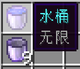

# 无限流体桶
给桶附魔无限！

## 概要
- 水桶可以附魔无限，可以无限倒水。
- 铁桶可以附魔无限，可以无限销毁流体。
- 奶桶可以附魔无限，可以无限饮用。
- 玻璃瓶可以附魔无限，可以无限销毁流体。
- 水瓶可以附魔无限，可以无限给水。
## 介绍
可以用附魔台或铁砧给桶附魔无限。

每个物品可以从配置文件或《模组菜单》单独开关。

可以只安装在服务端，只不过客户端可能有一点同步问题。
### 无限水桶
- 可以无限放置水。
- 可以无限向炼药锅填充水。
- 在发射器中，可以无限放置水。
- 可以向模组的流体储罐无限提供水，每次提供一桶水。
- 不会在合成中消耗。
- 不可以捕鱼。
### 无限铁桶
- 可以无限舀起并销毁流体源。
- 可以无限清空炼药锅中的流体和细雪。
- 在发射器中，可以无限舀起并销毁流体源。
- 可以被模组的流体储罐无限输入流体，每次可以输入一桶量的流体。输入的流体会被销毁。
- 不能用于合成。
- 不能在熔炉中接取湿海绵的水。
- 不可以挤奶。
### 无限奶桶
- 可以无限饮用。
- 不会在合成中消耗。
### 无限玻璃瓶
- 可以无限从炼药锅无限舀起并销毁水。
- 可以无限收集并销毁龙息。
- 可以无限从装满蜂蜜的蜂巢和蜂箱收集并销毁蜂蜜。
- 可以被模组的流体储罐无限输入流体，每次可以输入一瓶量的流体。输入的流体会被销毁。
- 不能用于合成。
### 无限水瓶
- 可以无限向炼药锅倒水。
- 可以无限把泥土变成泥巴。
- 可以向模组的流体储罐无限提供水，每次提供一瓶水。
- 不会在合成中消耗。
- 不能用于酿造。
## 画廊

## 你知道吗
本模组灵感来源于《夸克》中的无限水桶。